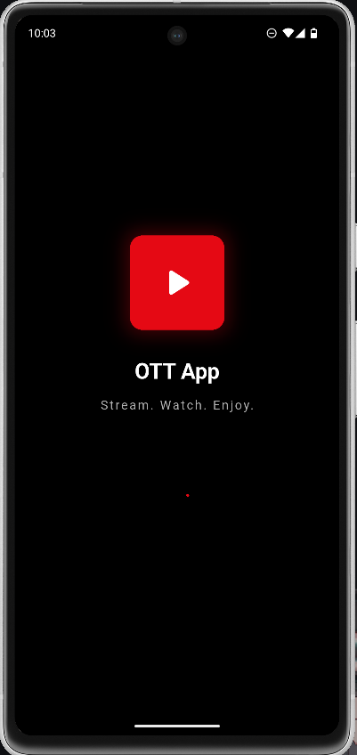
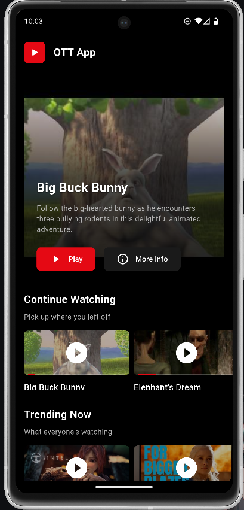
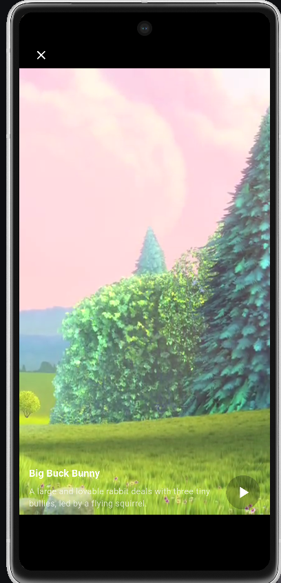

# Flutter OTT App

A video streaming app for Android with Netflix-style UI and reels-like video navigation.

## Features

**Home Screen**
- Horizontal carousels with video thumbnails
- Multiple categories (Trending, Movies, Web Series)
- Tap thumbnail to play video

**Video Player**
- Full-screen video playback
- Vertical swipe to next video (like reels)
- Auto-play functionality
- Basic playback controls

## Tech Stack

- Flutter
- better_player package for video playback
- flutter_bloc for state management
- Mock JSON data (no API calls)

## Getting Started

1. Clone the repo
```bash
git clone https://github.com/yourusername/flutter-ott-app.git
cd flutter-ott-app
```

2. Install dependencies
```bash
flutter pub get
```

3. Run the app
```bash
flutter run
```

## Build APK

```bash
flutter build apk --release
```

APK location: `build/app/outputs/flutter-apk/app-release.apk`

## Screenshots

| Home Screen | Video Player | App Navigation |
|-------------|--------------|----------------|
|  |  |  |

## Demo Videos

### App Demo
[](https://www.youtube.com/watch?v=dQw4w9WgXcQ)

## APK Download

📱 **[Download APK](https://drive.google.com/file/d/18NXbx2JosiqxORRh8RR7ZXNly7_rvVGk/view?usp=sharing)**

*Note: Download the APK file and install it on your Android device. Make sure to enable "Install from unknown sources" in your device settings.*

## Assignment Details

This app was built as a coding assignment with the following requirements:
- 3-5 hours development time
- Netflix-style home screen with carousels
- Reels-style video player with vertical navigation
- Clean code and responsive design
- Android platform only

## Made by Gautam kumar <3
